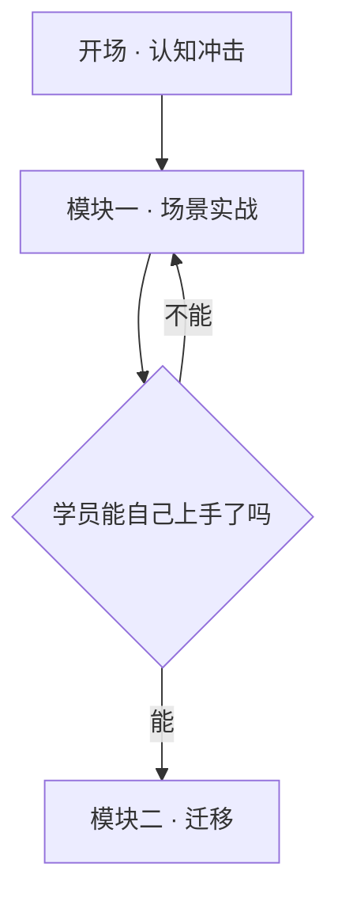

# 结构可视化 · mermaid-visual

> 图不能替你想清楚。想清楚了，图才有用。
> 本技能只做最后一步：把已经成立的结构，画成一眼能看懂的东西。

## 硬约束

1. **结构没定就不画。** 拿到需求先复述一遍要画的结构，搭档确认了才动手。**未满足本步退出条件，不得进入下一步。**
2. **一张图一个意思。** 节点超过 15 个就拆成两张，不做"什么都有"的大图。
3. **不发明内容。** 图里出现的每个节点、每条连线，都必须能在原材料里找到出处。**缺的环节标成虚线加问号，不许自己补一个看起来合理的。**
4. **先交代码后交图。** Mermaid 代码块是主交付物，PNG 是可选增强。没有渲染环境不算失败。
5. **不装东西。** `mmdc` 不存在时用 `npx` 一次性调用，`npx` 也不通就降级交代码，**不得为了出图去装全局包**。

## 权限与数据边界

| 项 | 边界 |
|----|------|
| 读 | 本工作区 `memory/`、搭档交来的材料 |
| 写 | 图文件与 Mermaid 源码（`memory/diagrams/` 或搭档指定路径）；**不写入任何其他 Agent 的工作区** |
| 外发 | 无。不使用任何在线渲染服务，不把内容 POST 到第三方图床 |
| 敏感数据 | 内部项目名、客户名、未公开数据不进图 —— 图最容易被截图外传 |
| 升权 | 仅调用本机已有的 `mmdc` / `npx`；不装全局包、不 sudo |

## 何时使用 / 何时不用

| 场景 | 用不用 |
|------|--------|
| "把课程六个模块的关系画出来" | ✅ 用 |
| "团队诊断结论画成一张图" | ✅ 用 |
| "这个决策链条能不能可视化" | ✅ 用 |
| "帮我做张封面/海报" | ❌ 做不了，本技能只有 Mermaid，没有生图能力 |
| "这几个方案哪个好" | ❌ → `roi-deep-dive` |
| "先帮我理清楚这块的结构" | ❌ 先理清楚，理清楚了再回来 |

**降级信号**：画到一半发现连线连不通 → 说明结构本身有洞，停下来告诉搭档"这里缺一环"，别用箭头糊过去。

## 输入输出契约

**输入**：一个已经成立的结构（课程大纲 / 诊断结论 / 流程步骤 / 对比维度）
**输出**：Mermaid 代码块（必交）+ PNG（有渲染环境时）+ 一句图注说明这张图想让人看到什么
**上游**：`course-material-pack` 的课程结构 / `team-health-diagnosis` 的诊断结论 / `oscar-research` 的信息地图
**下游**：讲师手册、学员手册、诊断报告的插图位
**串联示例**：`team-health-diagnosis`（出结论）→ `mermaid-visual`（画图）→ `human-writing`（写报告正文）

## 流程

### Step 1 · 复述结构

用一句话说清这张图要让人看到什么，再列出节点和关系。

**标准话术**：

> "我理解要画的是：**[主体]** 分成 **[N]** 块，其中 [A] 和 [B] 是并列，[C] 由 [A] 推出来。图想让人一眼看到的是 **[哪个对比或哪条路径]**。对吗？"

**退出条件**：搭档确认这句复述，或明确说"你看着办"。**未满足本步退出条件，不得进入下一步。**
**常见失败**：直接开画，画完发现搭档要的是另一种关系，整张返工。

### Step 2 · 选图型

按"要让人看到什么"选，不按内容多少选。判据表见 `assets/chart-patterns.md`。

| 想让人看到 | 图型 | Mermaid 关键字 |
|-----------|------|---------------|
| 先后顺序、流程 | 流程图 | `flowchart LR` / `TD` |
| 层级、拆解 | 树 / 思维导图 | `flowchart TD` / `mindmap` |
| 分叉判断 | 决策树 | `flowchart TD` + 菱形节点 |
| 时间推进 | 时间线 | `timeline` / `gantt` |
| 角色互动 | 时序图 | `sequenceDiagram` |
| 状态流转 | 状态机 | `stateDiagram-v2` |
| 两维定位 | 四象限 | `quadrantChart` |
| 构成占比 | 饼图 | `pie` |

**退出条件**：图型选定，且能说出为什么不是相邻的那一种。
**常见失败**：什么都画成 flowchart，层级图和流程图混用，读者分不清箭头是"接下来"还是"包含"。

### Step 3 · 写代码

节点文字 **≤10 字**，长句放图注不放节点。层级 ≤4 层。中文节点文字用 `["..."]` 包住，避免特殊字符打断解析。



**退出条件**：代码块能被 Mermaid 解析（无渲染环境时逐条检查括号、引号、箭头方向配对）。
**常见失败**：节点里塞一整句话，图变成竖排文字墙。

### Step 4 · 出图（可选）

```bash
command -v mmdc >/dev/null && mmdc -i diagram.mmd -o diagram.png -b transparent \
  || npx --yes @mermaid-js/mermaid-cli -i diagram.mmd -o diagram.png -b transparent
```

两条都不通就跳过，交代码块。

**退出条件**：PNG 生成成功，或已明确记录"本机无渲染环境，交代码块"。

### Step 5 · 交付

代码块 + 一句图注 + （有的话）PNG 路径。图注写"这张图想让人看到什么"，不复述图里已有的内容。

**退出条件**：自检闸门全过。

## 自检闸门

交付前逐条打勾，**有一条不过就回退到对应步骤**：

- [ ] 搭档确认过要画的结构　→ 不过回 Step 1
- [ ] 图型与"想让人看到什么"对得上　→ 不过回 Step 2
- [ ] 节点 ≤15 个、单节点文字 ≤10 字、层级 ≤4　→ 不过回 Step 3
- [ ] 每个节点和每条连线都能在原材料找到出处　→ 不过回 Step 3
- [ ] 缺失环节用虚线加问号标出，没有自行补全　→ 不过回 Step 3
- [ ] 代码块可解析　→ 不过回 Step 3
- [ ] 图注说的是"想让人看到什么"，不是复述节点　→ 不过回 Step 5
- [ ] 图里没有内部项目名、客户名、未公开数据　→ 不过，立即改并向搭档报告

## 量化验收指标

| 指标 | 门槛 |
|------|------|
| 单图节点数 | ≤15（超了拆图） |
| 单节点文字 | ≤10 字 |
| 层级深度 | ≤4 层 |
| 无出处的节点或连线 | **0** |
| 交付物必含 Mermaid 代码块 | 100% |
| 为出图而安装的全局包 | **0** |
| 图注句数 | 1-2 句 |

## 常见失败模式

| 失败 | 表现 | 怎么避免 |
|------|------|---------|
| 图替思考 | 结构没想清就开画，用箭头掩盖断层 | Step 1 先复述 |
| 大而全 | 一张图塞 30 个节点，谁也看不清 | 超 15 个必拆 |
| 图型错配 | 层级关系画成流程，箭头含义混乱 | Step 2 按"想看到什么"选 |
| 文字墙 | 节点里写一整句 | 长句进图注 |
| 自行补全 | 缺的环节顺手补一个合理的 | 虚线加问号 |
| 死磕渲染 | 为出 PNG 装一堆全局包 | 两次不通就交代码 |
| 图注废话 | "本图展示了三个模块的关系" | 图注只说结论 |

## 降级与失败路径

**没有渲染环境**：交 Mermaid 代码块 + 说明"粘进任何支持 Mermaid 的编辑器即可看到"。这是完整交付，不是残缺交付。

**结构太复杂画不下**：拆成"总图 + 分图"，总图只画 5-7 个大块，每块一张分图。不要缩小字号硬塞。

**结构本身有洞**：如实说"这里缺一环"，把洞画成虚线问号节点交回去。**绝不用一条箭头把两个接不上的东西连起来** —— 图一旦画出来就会被当成结论传下去，这是本技能最大的风险。

**搭档要的是插画或海报**：直说本技能只有 Mermaid，做不了。不要用 ASCII 艺术或表格拼图凑数。

## 执行留痕与记忆写回

**留痕**：Mermaid 源码与 PNG 一起存 `memory/diagrams/YYYY-MM-DD-<主题>.mmd`。源码在，图就能重生成、能改。只存 PNG 等于交付了一张改不动的图。

**写回 `memory/YYYY-MM-DD.md`**：

1. 画了什么图、给哪份材料用
2. 选了哪个图型、为什么不是相邻的那种
3. 画的过程中暴露出的结构断层（**这条最值钱** —— 画不通的地方通常是想不通的地方）
4. 本机渲染环境是否可用（下次不用重试）

**沉淀进 `MEMORY.md`**：本机渲染环境状态（有无 `mmdc`）+ 搭档偏好的图型与配色。
