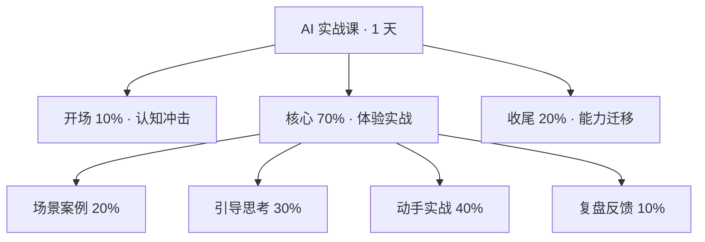
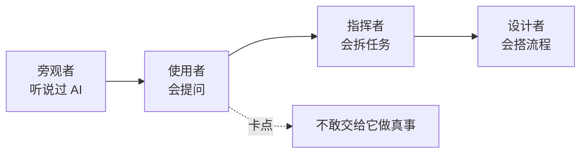
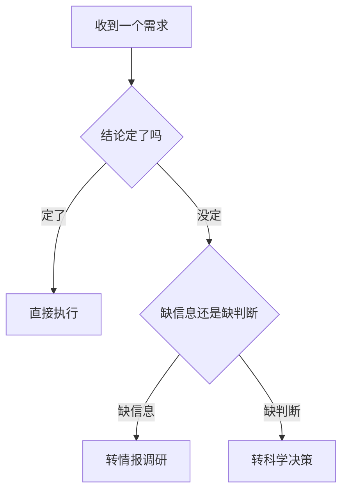
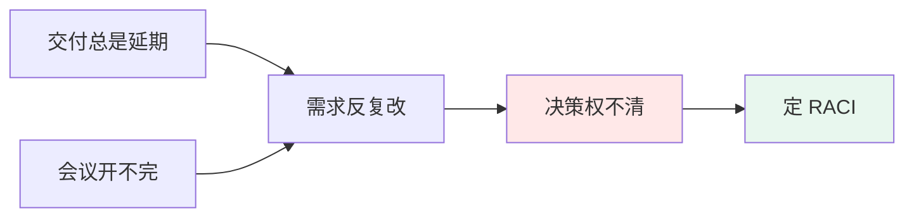
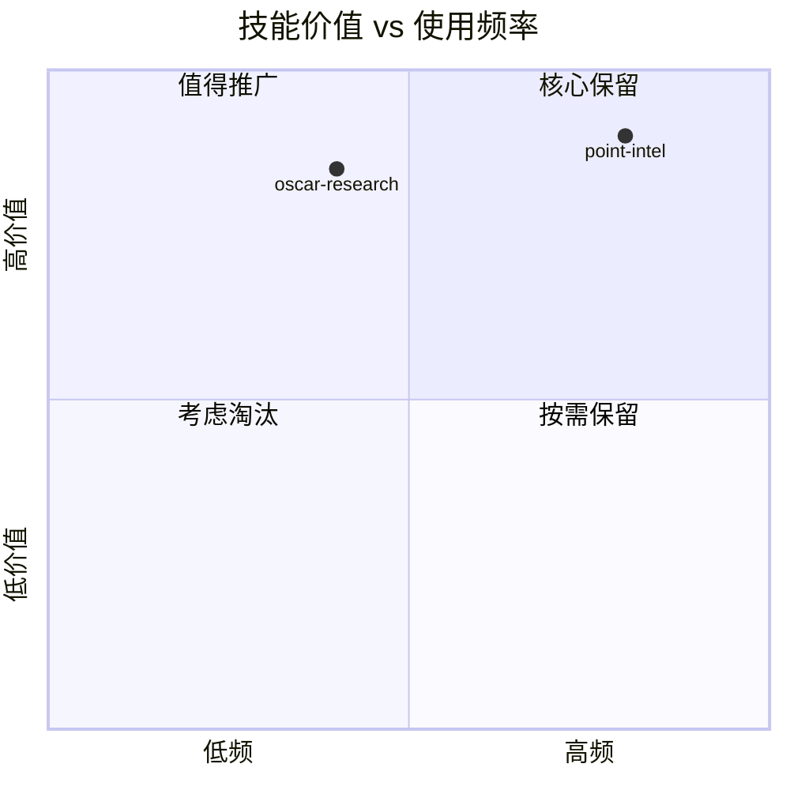
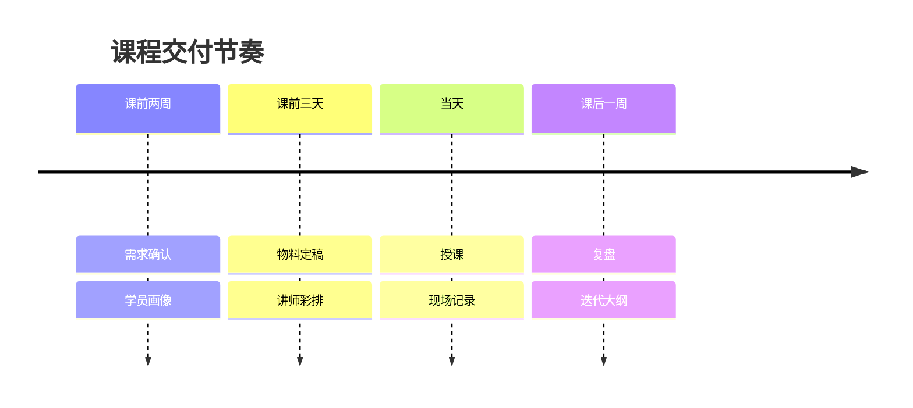
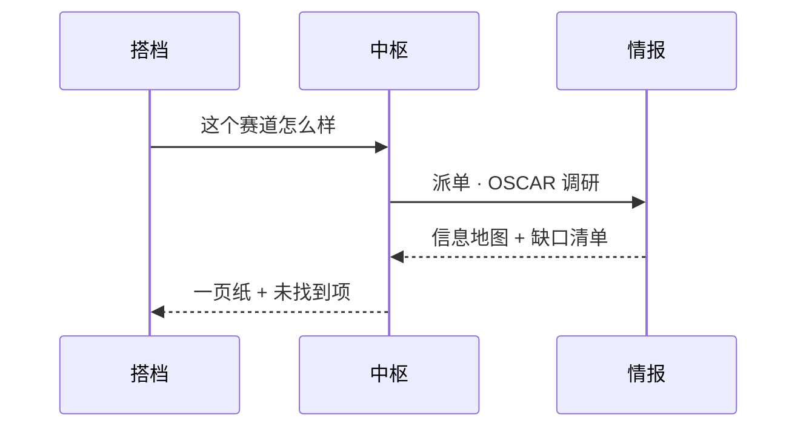
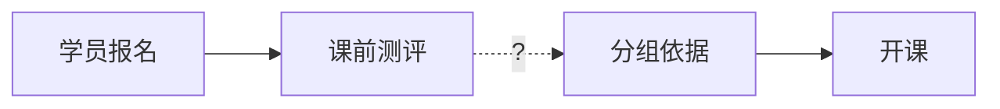

# 图型选择判据与可粘贴样板

> 选图型的依据永远是「想让人看到什么」，不是「内容有多少」。
> 下面每一段都可以直接改字使用。节点文字 ≤10 字，层级 ≤4，单图节点 ≤15。

## 一、课程框架图（层级 + 时间占比）

想让人看到：整门课分几块、每块占多少时间、彼此什么关系。

## 二、学习路径 / 能力阶梯

想让人看到：学员现在在哪、下一步去哪、卡点在哪。

## 三、决策树

想让人看到：在哪个岔口按什么标准分叉。菱形节点是判断，矩形是动作。

## 四、诊断结论图（问题 → 根因 → 解法）

想让人看到：表面问题底下是什么，动哪一个最省力。

## 五、四象限定位

想让人看到：两个维度交叉后，谁在哪个格子。

## 六、时间线 / 阶段推进

想让人看到：事情按什么节奏发生。

## 七、角色互动（时序图）

想让人看到：谁先动、谁等谁、信息怎么传。

## 八、缺失环节怎么画

结构有洞时，**画成虚线加问号，不要补一个看起来合理的节点**。

图注写清："分组依据这一环目前没有材料，虚线处待补。"

## 样式约定

- 强调用浅色填充，不用粗边框：问题 `#ffe8e8`，解法 `#e8f7ee`，中性 `#eef2f7`
- 不用阴影
- 中文节点一律 `["..."]` 包住
- 换行用 ` `，不用真实换行
